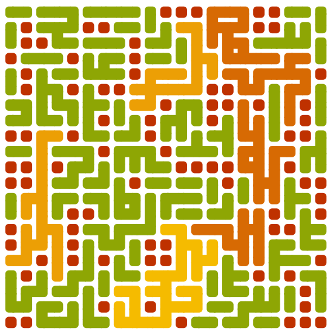

<div align="center">

  <h1><code>Genny</code></h1>

  <strong>A playground for creating generative art, buit with Rust🦀 and WASM🕸</strong>
</div>

## About

This is a simple playground that allows me to explore ideas around generative art. Currently it generates images similar to the following:



It supports some basic level of customization (theme, size), and every time you change settings or reload the page, a new image is generated.

<h2><strong>You can play with it <a href="https://jgpaiva.github.io/genny/">here</a>.</strong></h2>

## 🚴 Usage

If you'd like to play with the dev version, all you need to do is clone this repo, and then run the following two commands in two separate terminals:
```
./start_auto_build.sh
```
This will start an auto-build, that'll rebuild the project everytime you make a change. (Depends on having `entr` and `wasm-pack` installed on the local machine)
```
./start_dev_server.sh
```
This'll start an auto-refresh browser window, which will refresh the page everytime there's a change to the build.

As long as you have these two commands running, you'll see realtime updates of the page as soon as you change and save a file, to get a really short feedback cycle between change and outcome.

All updates to the `/docs` folder are reflected on github pages <a href="https://jgpaiva.github.io/genny/">here</a>.
